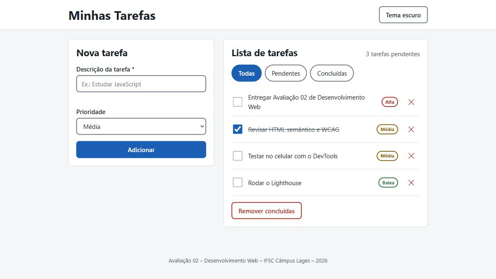

# Guia da Serra – Lages e Serra Catarinense

Guia turístico acessível e responsivo de **Lages e da Serra Catarinense**, feito somente com **HTML, CSS e JavaScript puro** (sem frameworks e sem bibliotecas).

Projeto da **Avaliação 02 – Desenvolvimento Web** do **IFSC Câmpus Lages** (2026/2).

**🔗 Acesse o site: https://kaiohomem.github.io/guia-da-serra/**



## Funcionalidades

- 9 lugares de Lages e da região, com foto, categoria, cidade e descrição
- Busca instantânea por nome ou cidade (ignora acentos: "urubici" encontra "Urubici")
- Filtro por categoria: Natureza, História, Gastronomia, Cultura e lazer
- Favoritos com coração ♥ e filtro "Só favoritos"
- Janela de detalhes com foto grande, crédito da foto e link para o mapa
- Formulário para o visitante sugerir novos lugares, com validação
- Favoritos e sugestões salvos no navegador (`localStorage`)
- Tema claro e escuro
- Efeitos: confete ao favoritar, cards que levantam no hover, animação de entrada e saída, aviso flutuante

## Lugares do guia

| Lugar | Cidade | Categoria |
|---|---|---|
| Catedral Diocesana de Lages | Lages | História |
| Convento Franciscano São José | Lages | História |
| Coxilha Rica | Lages | Natureza |
| Festa Nacional do Pinhão | Lages | Gastronomia |
| Estádio Vidal Ramos Júnior (Tio Vida) | Lages | Cultura e lazer |
| Serra do Rio do Rastro | Bom Jardim da Serra | Natureza |
| Morro da Igreja e Pedra Furada | Urubici | Natureza |
| Cascata do Avencal | Urubici | Natureza |
| Vinhedos de altitude | São Joaquim e região | Gastronomia |

## Tecnologias

| Tecnologia | Uso |
|---|---|
| HTML5 | Estrutura semântica, `<dialog>` e atributos ARIA |
| CSS3 | Variáveis, Flexbox, Grid automático, media queries, animações |
| JavaScript (ES Modules) | Lógica, manipulação do DOM, eventos, Web Animations API |

## Como executar

O projeto usa módulos JavaScript (`import`/`export`). Por isso **não funciona abrindo o `index.html` com duplo clique**: o navegador bloqueia módulos em arquivos locais (`file://`). É preciso um servidor local.

**Opção 1 – VS Code:** instale a extensão *Live Server*, clique com o botão direito no `index.html` e escolha *Open with Live Server*.

**Opção 2 – Terminal (Python):**

```bash
python -m http.server 5500
```

Depois abra http://localhost:5500 no navegador.

## Estrutura do projeto

```
├── index.html            Estrutura da página
├── css/
│   └── style.css         Estilos, temas e responsividade
├── js/
│   ├── main.js           Ponto de entrada: eventos e estado da aplicação
│   ├── dados.js          Lista de lugares (array de objetos)
│   ├── regras.js         Busca, filtros, favoritos e validação (não mexe na tela)
│   ├── interface.js      Cria os cards e a janela de detalhes na tela
│   ├── armazenamento.js  Salva e carrega no localStorage
│   └── efeitos.js        Animações e efeitos visuais
├── img/                  Fotos dos lugares (Wikimedia Commons)
└── docs/
    ├── screenshot.jpg
    └── apresentacao.md   Roteiro da apresentação
```

Cada arquivo JavaScript é um **módulo** com uma responsabilidade só. Todos têm comentários em português explicando o código.

## Requisitos da avaliação

### Usabilidade e acessibilidade (WCAG)

- Link "Pular para o conteúdo principal", visível ao navegar com Tab
- Foco sempre visível (`:focus-visible`) e interface inteira utilizável só com teclado
- **Texto alternativo (`alt`) descrevendo cada foto**
- Janela de detalhes com `<dialog>`: prende o foco, fecha com Esc e devolve o foco ao botão que a abriu
- Busca marcada com `role="search"`; resultado anunciado com `aria-live`
- Botões de filtro e de favorito com `aria-pressed` (o leitor de tela diz se estão ligados)
- Formulário com `<label>`, erros ligados aos campos (`aria-describedby`, `aria-invalid`) e foco levado ao primeiro erro
- Link do mapa avisa que abre em nova aba
- Categoria indicada por texto, não só por cor
- Botões com área mínima de 44px para toque
- Animações desligadas quando o sistema pede menos movimento (`prefers-reduced-motion`)

### HTML semântico

`header`, `main`, `section` com `aria-labelledby`, `article` em cada card, `ul`/`li`, `form`, `label`, `dialog`, `figure`/`figcaption`, `dl`/`dt`/`dd`, `footer`; títulos em ordem (`h1` > `h2` > `h3`); `lang="pt-BR"`.

### Design responsivo

- Mobile-first: o CSS base é para celular
- Cards com `grid-template-columns: repeat(auto-fill, minmax(260px, 1fr))`: 1 coluna no celular, 2 no tablet, 3 no desktop, sem media query
- `@media (min-width: 700px)` e `(min-width: 1000px)`: formulário em 2 e 3 colunas
- Título com `clamp()`, que cresce com a tela; fontes em `rem`
- Fotos com `object-fit: cover` e `loading="lazy"`

### JavaScript

- Variáveis (`const`, `let`) e operadores (`===`, `&&`, `||`, `!`, ternário, spread `...`)
- Funções e arrow functions
- Objetos (cada lugar é um objeto) e arrays (`filter`, `find`, `includes`, `forEach`, `map`)
- Módulos ES (`import` / `export`)
- Manipulação do DOM, delegação de eventos e `<dialog>` com `showModal()`
- `localStorage` com JSON
- `async` / `await` e Promises nas animações

## Segurança

O site é estático (não tem servidor, banco de dados nem senha), mas o JavaScript trata como "não confiável" tudo que vem do usuário ou do `localStorage`:

- **Proteção contra XSS (injeção de script):** textos digitados entram na página sempre com `textContent`, nunca com `innerHTML`. Um nome como `` aparece só como texto.
- **Content-Security-Policy:** a página só executa scripts e carrega imagens e estilos dos próprios arquivos (`'self'`).
- **Dados do `localStorage` validados:** `JSON.parse` dentro de `try/catch` (dados corrompidos não derrubam o site); sugestões e favoritos conferidos campo a campo; categoria e tema só aceitam valores conhecidos.
- **Limites de tamanho** garantidos no JavaScript, não só no `maxlength` do HTML.
- Links externos com `rel="noopener"` e política de `referrer`.
- Nenhuma senha, chave de API ou dado pessoal no código.

> Observação: a extensão *Live Server* injeta um script próprio para recarregar a página. A Content-Security-Policy bloqueia esse script, então aparece um aviso no console e a página não recarrega sozinha ao salvar (é só apertar F5). Com `python -m http.server` isso não acontece.

## Avaliação de acessibilidade

| Ferramenta / técnica | Resultado |
|---|---|
| axe-core 4.10 (motor da extensão axe DevTools) | 0 violações, 46 regras aprovadas (WCAG 2.0/2.1 A e AA), nos temas claro e escuro e na janela de detalhes |
| Contraste – texto principal | 14.6:1 (claro) e 14.2:1 (escuro). Mínimo: 4.5:1 |
| Contraste – botões | 7.5:1 (claro) e 10:1 (escuro) |
| Contraste – bordas dos campos | 4.4:1 (claro) e 5.1:1 (escuro). Mínimo: 3:1 (critério 1.4.11) |
| Teclado | Tab, Shift+Tab, Enter, Espaço e Esc funcionam em toda a interface |
| Responsivo | Testado em 375px (celular) e desktop, sem rolagem horizontal |

## Créditos das fotos

Todas as fotos vêm do [Wikimedia Commons](https://commons.wikimedia.org) e foram redimensionadas para 800px de largura.

| Foto | Autor | Licença |
|---|---|---|
| [Catedral Diocesana de Lages](https://commons.wikimedia.org/wiki/File:Catedral_Diocesana_de_Lages.jpg) | Filipeschaves | CC BY-SA 4.0 |
| [Convento Franciscano São José](https://commons.wikimedia.org/wiki/File:Convento_Franciscano_S%C3%A3o_Jos%C3%A9_-_LAGES.jpg) | Dee Becker | CC BY-SA 4.0 |
| [Coxilha Rica](https://commons.wikimedia.org/wiki/File:Vista_da_Coxilha_Rica,_com_destaque_para_o_Viaduto_Ferrovi%C3%A1rio_Rio_Tatetos_(02-05-2020).jpg) | Gibbneckel | CC BY-SA 4.0 |
| [Pinhão](https://commons.wikimedia.org/wiki/File:Pinh%C3%A3o_(Garfada).jpg) | Marcelo Träsel | CC BY-SA 2.0 |
| [Estádio Tio Vida](https://commons.wikimedia.org/wiki/File:3_7_2021_-_Entardecer_no_Tio_Vida_(51330130575).jpg) | Inter de Lages | CC BY 2.0 |
| [Serra do Rio do Rastro](https://commons.wikimedia.org/wiki/File:Serra_do_Rio_do_Rastro_2019.jpg) | Fernandokaiserbr | CC BY-SA 4.0 |
| [Morro da Igreja e Pedra Furada](https://commons.wikimedia.org/wiki/File:Morro_da_Igreja_-_Pedra_Furada_-_Zoom.jpg) | AlexandreMachado | CC BY-SA 4.0 |
| [Cascata do Avencal](https://commons.wikimedia.org/wiki/File:Cascata_do_Avencal-_Urubici-_SC_01.jpg) | Elaine Alessio | CC BY-SA 4.0 |
| [Vinhedos da Serra Catarinense](https://commons.wikimedia.org/wiki/File:Vinhedos_da_Serra_Catarinense_01.jpg) | Elaine Alessio | CC BY-SA 4.0 |

## Autor

**Kaio Homem** – [@KaioHomem](https://github.com/KaioHomem)

Instituto Federal de Santa Catarina – Câmpus Lages

## Licença

O código está sob a licença MIT (veja [LICENSE](LICENSE)). As fotos da pasta `img/` mantêm as licenças Creative Commons dos seus autores, listadas acima.
